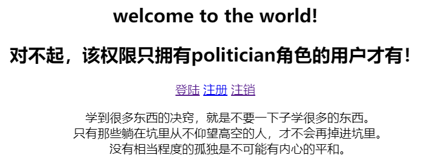

# shiro学习项目简介
该项目采用了是springboot+mybatis-plus+thymeleaf+shiro+redis(缓存)技术。
数据总共三张表，分别为用户表stu,角色表roles以及用户角色表stu_roles。
页面也只有三张，分别为注册页面(regist.html)，登陆页面(login.html)，成功页面(index.html)。
仅适用于学习技术。

# 具体概述
成功页面(index.html),设置了数据展示所需要的角色权限

未拥有politician角色的用户注册情况

拥有所有角色的用户注册情况

缓存只做了用户认证和授权，查询没有做缓存

