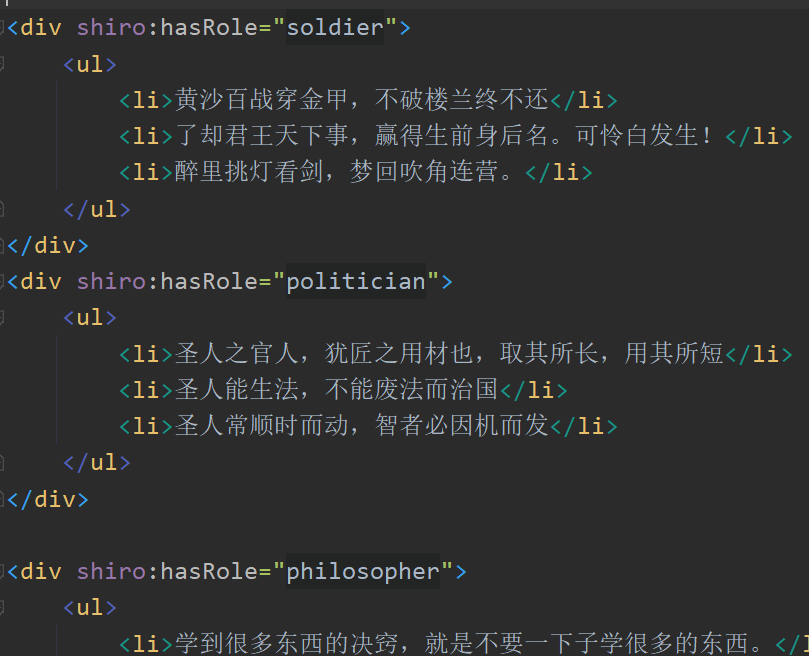
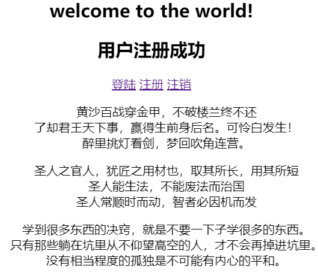
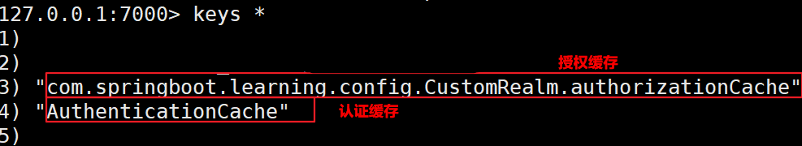

# 工程简介
本项目采用springboot+mybatis-plus+vue+redis(缓存)+shiro框架技术。
    使用了三张表，分别为管理员表user_role,普通用户表t_user,员工表t_emp,设置了只有管理员有删除员工的权限。
    总体实现了数据的增删改查,事物管理功能以及设置了权限控制等功能。
# 延伸阅读
数据过少，故而没做分页条。
没有做前后端分离。
only for learning

主页面

修改页面

缓存的数据

普通用户删除员工数据

管理员用户删除员工数据

